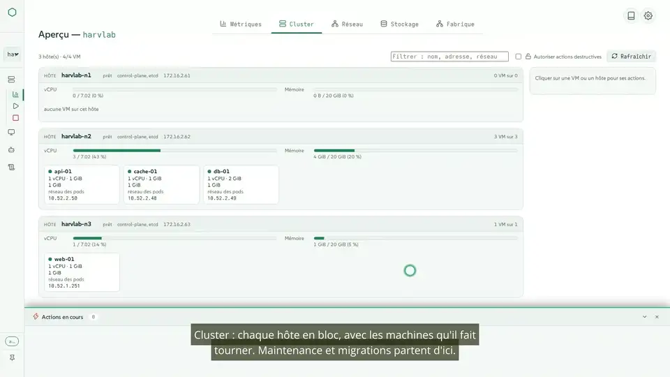
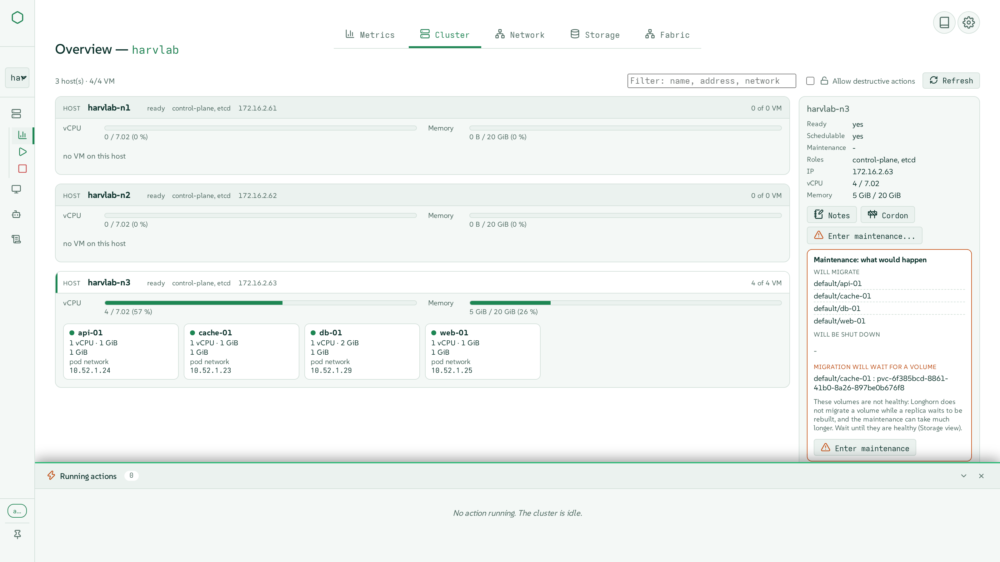
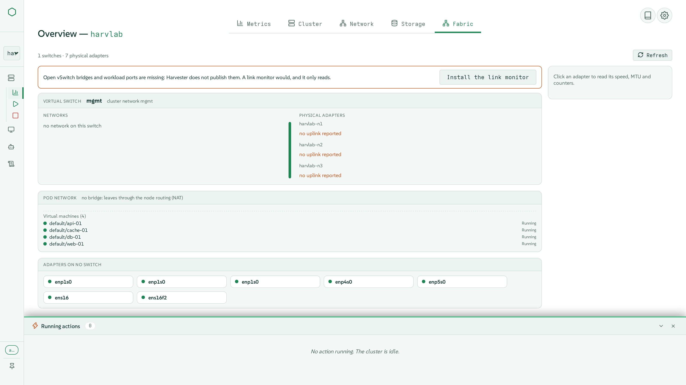
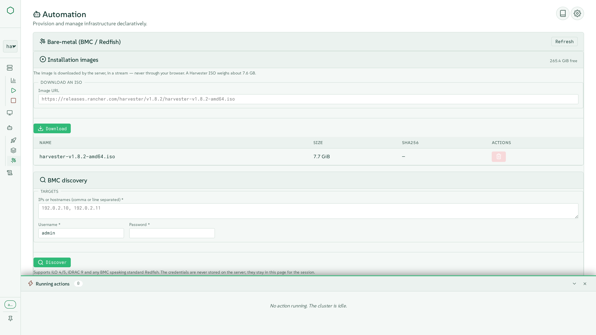

# harvester-ops

**Éteindre proprement un cluster SUSE Harvester, le remonter dans le bon
ordre, et l'exploiter au quotidien depuis une seule console.**

[English](README.md) · Français

[](LICENSE)
[](https://github.com/jniedergang/harvester-ops/releases/latest)
[](tests/)

> Projet libre et indépendant. Sans lien avec SUSE, ni approuvé ni pris en
> charge par SUSE.

[](https://github.com/jniedergang/harvester-ops/releases/download/v1.44.10/tour-fr.mp4)

*Le tour de la console, en descendant le menu de gauche. Cliquer sur
l'image pour la vidéo complète.*

## Pourquoi

Un cluster Harvester n'aime pas qu'on le coupe au disjoncteur. L'arrêter
proprement, c'est prendre un instantané d'etcd, arrêter les machines
virtuelles dans un ordre sensé, attendre que Longhorn ait lâché chaque
volume, isoler les nœuds, puis les éteindre en gardant le plan de contrôle
pour la fin. Le redémarrer, c'est la même liste à l'envers, en attendant à
chaque étape que le cluster soit prêt pour la suivante.

harvester-ops fait les deux. Depuis une ligne de commande qui fonctionne
sur un site coupé du réseau, ou depuis une console web qui montre chaque
étape au moment où elle se déroule et s'arrête si un contrôle échoue.
Autour de ce cœur, l'outil est devenu une console d'exploitation pour
Harvester : cluster et maintenance des nœuds, machines virtuelles,
stockage, réseau, Cluster API, Terraform et installation bare-metal, pour
plusieurs clusters à la fois.

## À voir

De courtes vidéos tournées sur un vrai cluster de trois nœuds, sous-titrées.
Les attentes sont accélérées, avec le facteur affiché à l'écran ; rien
n'est coupé.

| Vidéo | Ce qu'on y voit | Regarder |
|---|---|---|
| **Le tour** | Chaque entrée du menu, de haut en bas, et les cinq langues de l'interface | [Français](https://github.com/jniedergang/harvester-ops/releases/download/v1.44.10/tour-fr.mp4) · [English](https://github.com/jniedergang/harvester-ops/releases/download/v1.44.10/tour-en.mp4) |
| **Arrêt et redémarrage** | Tout un cluster éteint dans l'ordre, puis remonté | [Français](https://github.com/jniedergang/harvester-ops/releases/download/v1.44.10/shutdown-startup-fr.mp4) · [English](https://github.com/jniedergang/harvester-ops/releases/download/v1.44.10/shutdown-startup-en.mp4) |
| **Maintenance d'un nœud** | Le pré-contrôle, un hôte vidé pendant que ses VMs migrent à chaud, puis une VM déplacée à la main | [Français](https://github.com/jniedergang/harvester-ops/releases/download/v1.44.10/cluster-maintenance-fr.mp4) · [English](https://github.com/jniedergang/harvester-ops/releases/download/v1.44.10/cluster-maintenance-en.mp4) |
| **Machines virtuelles** | La liste des VMs, la création guidée, et la console intégrée | [Français](https://github.com/jniedergang/harvester-ops/releases/download/v1.44.10/vms-console-fr.mp4) · [English](https://github.com/jniedergang/harvester-ops/releases/download/v1.44.10/vms-console-en.mp4) |
| **Stockage** | La place réellement disponible, et un volume dégradé expliqué pendant sa reconstruction | [Français](https://github.com/jniedergang/harvester-ops/releases/download/v1.44.10/storage-fr.mp4) · [English](https://github.com/jniedergang/harvester-ops/releases/download/v1.44.10/storage-en.mp4) |
| **Réseau** | Les réseaux, la fabrique physique, et le chemin d'une VM | [Français](https://github.com/jniedergang/harvester-ops/releases/download/v1.44.10/network-fr.mp4) · [English](https://github.com/jniedergang/harvester-ops/releases/download/v1.44.10/network-en.mp4) |
| **Instantanés** | Une VM photographiée, modifiée, puis restaurée | [Français](https://github.com/jniedergang/harvester-ops/releases/download/v1.44.10/snapshots-fr.mp4) · [English](https://github.com/jniedergang/harvester-ops/releases/download/v1.44.10/snapshots-en.mp4) |
| **Activité** | Toutes les actions conservées avec leur journal, et un paquet de support | [Français](https://github.com/jniedergang/harvester-ops/releases/download/v1.44.10/activity-fr.mp4) · [English](https://github.com/jniedergang/harvester-ops/releases/download/v1.44.10/activity-en.mp4) |
| **Plusieurs clusters** | Changer de cluster, dont un éteint, les rôles et les comptes | [Français](https://github.com/jniedergang/harvester-ops/releases/download/v1.44.10/multi-cluster-fr.mp4) · [English](https://github.com/jniedergang/harvester-ops/releases/download/v1.44.10/multi-cluster-en.mp4) |

## Ce qu'il fait

### Le séquençage, le cœur (ligne de commande et console)

- **Arrêt gracieux en huit étapes** : contrôles préalables, instantané
  etcd, instantanés de VMs au choix, VMs arrêtées par groupes réglables,
  volumes Longhorn détachés, nœuds isolés, puis extinction des workers et
  enfin du plan de contrôle.
- **Démarrage en cinq étapes** : le premier nœud de contrôle, puis les
  autres (par Wake-on-LAN quand une adresse MAC est déclarée), nœuds
  prêts, état du cluster rétabli, VMs relancées dans l'ordre inverse.
- **Filets de sécurité** : un contrôle en échec (instantané etcd, volume
  encore attaché) arrête la séquence sauf si on force ; seules les VMs
  arrêtées par l'extinction reviennent, avec leur stratégie d'origine ; un
  seul arrêt ou démarrage à la fois par cluster, depuis la console comme
  depuis la ligne de commande.

### La console d'exploitation

- **Vue Cluster** : un bloc par hôte, avec ses jauges de processeur et de
  mémoire et les VMs qu'il fait tourner. Maintenance des nœuds avec un
  pré-contrôle qui dit quelles VMs migreront, lesquelles s'arrêteraient et
  ce qui bloquerait la vidange, puis la vidange suivie jusqu'au bout.
- **Machines virtuelles** : création avec la place réellement disponible
  vérifiée au fil de la saisie, édition de chaque section, modèles,
  instantanés et restauration, migration à chaud, actions en masse, et une
  console VNC que plusieurs personnes peuvent suivre ensemble.
- **Stockage** : classes, volumes et disques des nœuds, la place allouable
  telle que Longhorn la calcule, et les volumes dégradés diagnostiqués,
  avec les corrections sans risque.
- **Réseau** : les réseaux et ce qui y est raccordé, la fabrique physique
  (cartes, agrégats, commutateurs virtuels), le chemin d'une VM de bout en
  bout, LLDP.
- **Activité** : toute opération qui modifie quelque chose est enregistrée
  avec son journal en direct et conservée dans l'historique.

### L'automatisation

- **Cluster API (CAPHV)** : installer la pile depuis un paquet hors ligne,
  lister, redimensionner et supprimer les clusters RKE2 en aval, récupérer
  leur kubeconfig. Créer un cluster demande l'outil `caphv-generate` sur
  l'hôte.
- **Terraform** : déclarations sauvegardées (VMs, images, clés SSH, HCL
  brut), plan montré avant application, destruction, et le fournisseur
  Harvester installé ou mis à jour depuis la console.
- **Bare-metal** : trouver les machines par leur carte d'administration en
  Redfish, les allumer et les éteindre, tenir un magasin d'ISO, et
  installer Harvester sur une machine vierge sans intervention, par média
  virtuel.

### Pensé pour la production

- **Hors ligne** : un seul tarball avec sa somme SHA-256, les paquets
  Python et l'image du conteneur à l'intérieur ; rien n'est téléchargé à
  l'exécution.
- **Plusieurs clusters**, y compris des clusters éteints.
- **Rôles et identités** : lecteur, opérateur et administrateur, tout est
  refusé par défaut, et les actions sont portées sur le cluster sous
  l'identité propre de l'opérateur.
- **Cinq langues** (anglais, français, allemand, espagnol, italien), une
  bulle d'aide sur chaque contrôle, thèmes clair et sombre.
- Métriques Prometheus, sonde de disponibilité, et paquet de support
  anonymisé.

## Captures d'écran

| | |
|---|---|
| [](docs/assets/cluster.png) | [](docs/assets/vms.png) |
| Vue Cluster, avec un pré-contrôle de maintenance | Les machines virtuelles d'un espace de noms |
| [](docs/assets/shutdown.png) | [](docs/assets/storage.png) |
| Les huit étapes de l'arrêt | Le stockage, avec un volume en reconstruction |
| [](docs/assets/fabric.png) | [](docs/assets/console.png) |
| La fabrique physique du cluster | La console VNC intégrée |
| [](docs/assets/activity.png) | [](docs/assets/baremetal.png) |
| Activité : chaque action et son journal | Bare-metal : découverte Redfish et installation sans intervention |

Les captures montrent l'interface en anglais ; elle existe dans les cinq
langues.

## Démarrage rapide

```bash
# Sur le poste d'exploitation
tar xzf harvester-ops-<version>.tar.gz
cd harvester-ops-<version>
sudo ./install.sh                      # installeur interactif
sudo $EDITOR /etc/harvester-ops/config.yaml

# Ligne de commande : le cœur de séquençage, adapté aux sites hors ligne
harvester-status   --cluster prod
harvester-shutdown --cluster prod --interactive
harvester-startup  --cluster prod

# Console web, si elle a été installée
xdg-open https://localhost:8090
```

Chaque commande accepte `--dry-run`, qui montre ce qui se passerait sans
rien toucher. Voir [l'installation](docs/fr/installation.md) et la
[procédure opérationnelle](docs/fr/procedure-operationnelle.md).

## Comment c'est construit

- **Deux surfaces, un seul moteur.** Le séquençage vit dans des scripts
  bash lisibles (`bin/`), qui n'ont besoin que de `kubectl` et de `ssh`. La
  console (Flask, JavaScript simple, sans framework) lance ces mêmes
  scripts et ne les contourne jamais.
- **Toute modification est une action** : elle reçoit un identifiant dès
  son lancement, ses étapes arrivent en direct dans le navigateur, et son
  journal est conservé.
- **Livré en un seul tarball** construit sur SUSE BCI, installé comme un
  service systemd qui fait tourner un conteneur en lecture seule sous un
  compte sans privilège.

## Testé sur de vrais clusters

Les tests unitaires et navigateur tournent à chaque modification (plus de
1 000 tests côté serveur et 200 dans le navigateur). Cela ne suffit pas :
chaque fonctionnalité est aussi exercée sur un vrai cluster avant d'être
livrée, sur un cluster de production à un nœud et sur un cluster d'essai à
trois nœuds pour ce qui en demande plusieurs (maintenance, migration,
arrêt et redémarrage complets). Les vidéos ci-dessus ont été tournées sur
ce cluster d'essai, et leur tournage a trouvé et corrigé des défauts de la
maintenance, de l'arrêt et du démarrage qu'aucun cluster à un nœud ne
pouvait montrer ; le [journal des versions](CHANGELOG.md) raconte chacun
d'eux.

## Documentation

[Capacités](docs/fr/capabilites.md) ·
[Procédure opérationnelle](docs/fr/procedure-operationnelle.md) ·
[Architecture](docs/fr/architecture.md) ·
[Installation](docs/fr/installation.md) ·
[Bare-metal](docs/fr/bare-metal.md) ·
[Dépannage](docs/fr/depannage.md) ·
[Journal des versions](CHANGELOG.md) (en anglais)

<details>
<summary>Contenu du tarball</summary>

```
harvester-ops/
├── README.md, README.fr.md, VERSION, CHANGELOG.md, LICENSE
├── install.sh, uninstall.sh        installeur interactif
├── bin/
│   ├── harvester-shutdown.sh       moteur d'arrêt (8 étapes)
│   ├── harvester-startup.sh        moteur de démarrage (5 étapes)
│   ├── harvester-status.sh         état du cluster (texte ou JSON)
│   └── lib/common.sh               journaux, simulation, étapes en direct
├── web/                            la console (optionnelle)
│   ├── app.py
│   ├── templates/, static/         interface en JavaScript simple
│   └── vendor/                     paquets Python, pour les sites hors ligne
├── container/Containerfile         FROM registry.suse.com/bci/python:3.11
├── images/harvester-ops-ui.tar     image OCI (podman load)
├── config/                         configuration d'exemple, unité systemd
└── docs/en/, docs/fr/
```

</details>

## Contribuer

Voir [CONTRIBUTING.md](CONTRIBUTING.md) pour l'organisation du dépôt, la
mise en place et le circuit de publication. Chaque modification arrive
avec un test, une nouvelle `VERSION` et une entrée dans `CHANGELOG.md`.

## Licence

Licence Apache 2.0, voir [LICENSE](LICENSE).
