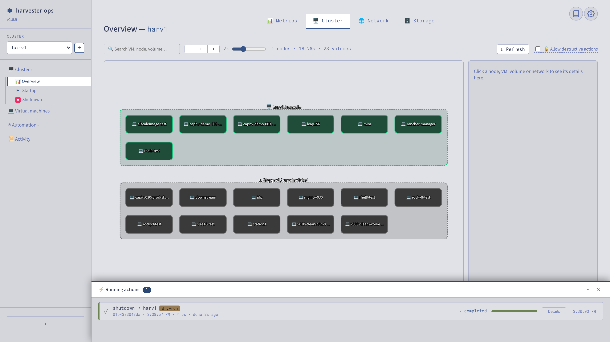
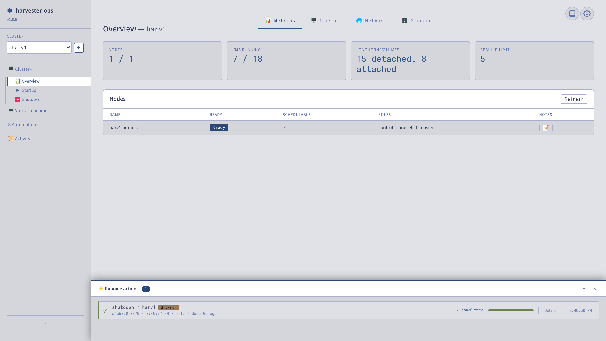
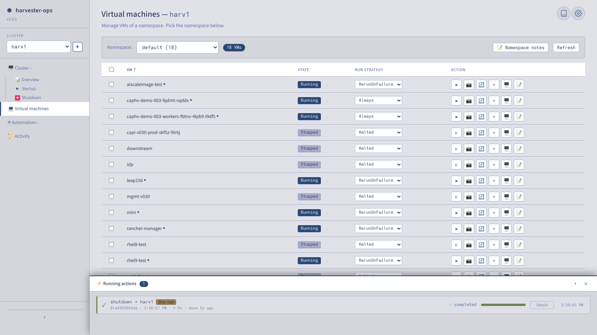
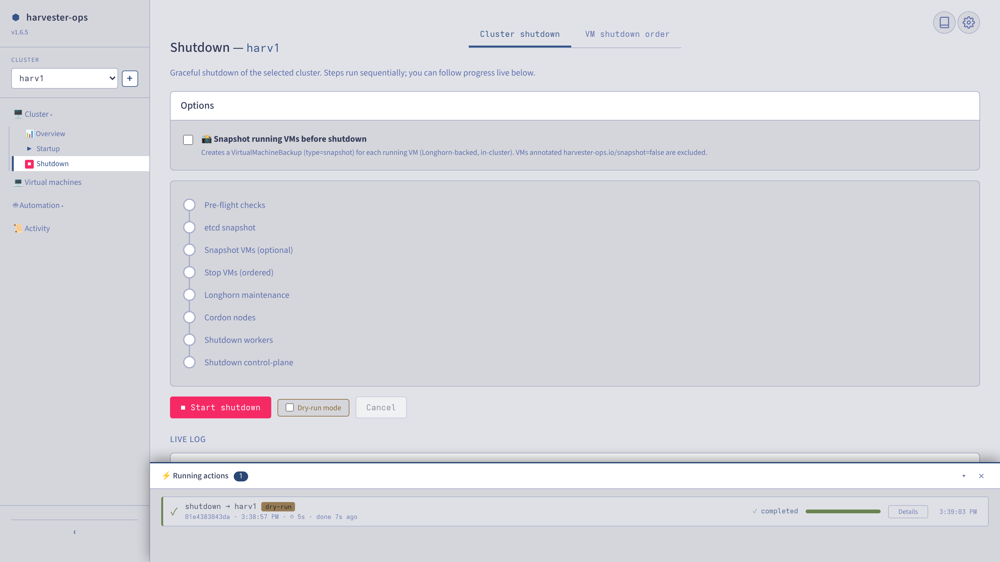
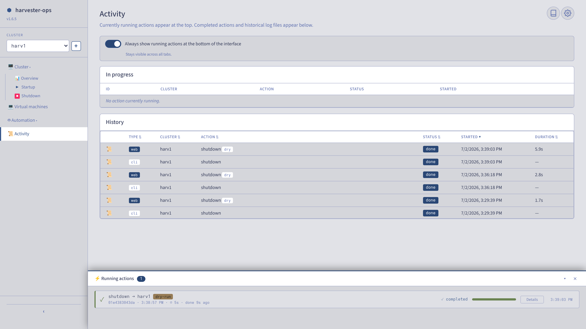

# harvester-ops

**An operations console for SUSE Harvester HCI clusters**
*Une console d'exploitation pour clusters SUSE Harvester HCI*

Self-contained, airgap-friendly, single-tarball delivery.
Livraison autonome en un tarball unique, compatible airgap.

[](LICENSE)
[](tests/)

> Independent project. Not affiliated with, endorsed by, or supported by SUSE.

---

## Screenshots / Captures d'écran

<picture>
  <source media="(prefers-color-scheme: dark)" srcset="docs/assets/topology-dark.png">
  
</picture>

*Live cluster topology: running VMs grouped by host node, stopped VMs bucketed apart, per-object details on click.*
*Topologie live du cluster : VMs actives groupées par nœud hôte, VMs arrêtées à part, détails par objet au clic.*

| [](docs/assets/overview.png) | [](docs/assets/vms.png) |
|---|---|
| *Cluster overview + persistent action dock<br>Aperçu cluster + dock d'actions persistant* | *VM lifecycle per namespace (bulk runStrategy, snapshots, console)<br>Cycle de vie VM par namespace (runStrategy en masse, snapshots, console)* |
| [](docs/assets/shutdown.png) | [](docs/assets/activity.png) |
| *8-step graceful shutdown sequencer with live SSE log<br>Séquenceur d'arrêt gracieux en 8 étapes avec log SSE live* | *Every mutating action tracked, with durable history<br>Toute action mutative tracée, avec historique durable* |

---

## EN — What this is

harvester-ops began as graceful shutdown / startup tooling and has grown
into a single-pane **operations console** for day-2 Harvester work: power
sequencing, VM lifecycle, cluster observability, downstream cluster
provisioning, infrastructure-as-code, and bare-metal discovery — all
multi-cluster, all auditable.

It ships as **two equivalent surfaces over one engine**:

- **CLI scripts** — auditable bash for the power-sequencing core
  (shutdown / startup / status), usable on any SLES/RHEL/Ubuntu host with
  `kubectl` and `ssh`. This is the airgap-safe path that never needs the UI.
- **Web console** (optional) — a Flask app with live SSE progress, a
  persistent action dock, cluster topology, and the higher-level
  automation surfaces (Cluster API, Terraform, bare-metal).

Every mutating operation — CLI or UI — is tracked as an action with live
logs and a retained history.

### Capability map

| Area | What it does | CLI | Web console |
|---|---|:---:|:---:|
| **Power sequencing** | Graceful shutdown (8 steps) / startup (5 steps), etcd snapshot, Longhorn maintenance, ordered VM stop/restart groups | ✓ | ✓ |
| **VM lifecycle** | Per-namespace VM list, bulk runStrategy, snapshots, live migration, serial console, inline edit + cloud-init | ✓ (`-N`) | ✓ |
| **Cluster observability** | Live topology (nodes / network / storage), Longhorn rebuild status, node table, Prometheus `/metrics`, readiness probe | status | ✓ |
| **Cluster API (CAPHV)** | Install the CAPI/CAPHV stack from an airgap bundle, create & scale downstream RKE2 clusters, roll K8s upgrades, manage bundles | — | ✓ |
| **Terraform (IaC)** | Saved multi-resource declarations (VMs, images, SSH keys, raw HCL), apply / destroy, edit deployed resources via sidecar JSON | — | ✓ |
| **Bare-metal** | BMC / Redfish discovery + power actions, PXE / DHCP / HTTP provisioning groundwork | — | ✓ |
| **Operations support** | Multi-cluster config, collaborative per-cluster / per-node notes, anonymised support bundles with a de-anonymisation tool | partial | ✓ |

The power-sequencing core is the only part needed for a pure
shutdown/startup deployment; everything else is opt-in and layered on the
same multi-cluster engine. See **[docs/en/capabilities.md](docs/en/capabilities.md)**
for the full tour.

### Quick start

```bash
# On the operations workstation
tar xzf harvester-ops-<version>.tar.gz
cd harvester-ops-<version>
./install.sh                       # interactive installer
$EDITOR /etc/harvester-ops/config.yaml

# CLI — the airgap-safe power-sequencing core
harvester-status   --cluster prod
harvester-shutdown --cluster prod --interactive
harvester-startup  --cluster prod

# Web console (if installed)
xdg-open https://localhost:8090
```

---

## FR — De quoi s'agit-il

harvester-ops est né comme outillage d'extinction / démarrage gracieux
et est devenu une **console d'exploitation** unifiée pour le day-2
Harvester : séquençage électrique, cycle de vie des VMs, observabilité
cluster, provisionnement de clusters downstream, infrastructure-as-code et
découverte bare-metal — le tout multi-cluster et auditable.

Il se présente comme **deux surfaces équivalentes sur un même moteur** :

- **Scripts CLI** — bash auditable pour le cœur de séquençage
  (shutdown / startup / status), utilisable depuis n'importe quel
  SLES/RHEL/Ubuntu avec `kubectl` et `ssh`. C'est la voie airgap qui ne
  dépend jamais de l'UI.
- **Console web** (optionnelle) — application Flask avec suivi SSE live,
  dock d'actions persistant, topologie cluster, et les surfaces
  d'automation de plus haut niveau (Cluster API, Terraform, bare-metal).

Toute opération mutative — CLI ou UI — est tracée comme une action avec
ses logs live et un historique conservé.

### Carte des capacités

| Domaine | Rôle | CLI | Console web |
|---|---|:---:|:---:|
| **Séquençage électrique** | Shutdown gracieux (8 étapes) / startup (5 étapes), snapshot etcd, maintenance Longhorn, groupes d'arrêt/redémarrage VM ordonnés | ✓ | ✓ |
| **Cycle de vie VM** | Liste par namespace, runStrategy en masse, snapshots, live migration, console série, édition inline + cloud-init | ✓ (`-N`) | ✓ |
| **Observabilité cluster** | Topologie live (nodes / réseau / stockage), état rebuild Longhorn, table des nodes, `/metrics` Prometheus, readiness probe | status | ✓ |
| **Cluster API (CAPHV)** | Installer la stack CAPI/CAPHV depuis un bundle airgap, créer & scaler des clusters RKE2 downstream, upgrades K8s, gestion des bundles | — | ✓ |
| **Terraform (IaC)** | Déclarations multi-ressources sauvegardées (VMs, images, clés SSH, HCL brut), apply / destroy, édition des ressources déployées via sidecar JSON | — | ✓ |
| **Bare-metal** | Découverte BMC / Redfish + actions d'alimentation, socle provisionnement PXE / DHCP / HTTP | — | ✓ |
| **Support aux opérations** | Config multi-cluster, notes collaboratives par cluster / par node, support bundles anonymisés avec outil de dé-anonymisation | partiel | ✓ |

Le cœur de séquençage est la seule partie nécessaire à un déploiement
shutdown/startup pur ; tout le reste est optionnel et s'empile sur le
même moteur multi-cluster. Voir **[docs/fr/capabilites.md](docs/fr/capabilites.md)**
pour le tour complet.

### Démarrage rapide

```bash
# Sur le poste d'exploitation
tar xzf harvester-ops-<version>.tar.gz
cd harvester-ops-<version>
./install.sh                       # installeur interactif
$EDITOR /etc/harvester-ops/config.yaml

# CLI — le cœur de séquençage, voie airgap
harvester-status   --cluster prod
harvester-shutdown --cluster prod --interactive
harvester-startup  --cluster prod

# Console web (si installée)
xdg-open https://localhost:8090
```

---

## Contents / Contenu du livrable

```
harvester-ops/
├── README.md                       This file / Ce fichier
├── VERSION                         Semantic version
├── install.sh / uninstall.sh       Interactive installer
├── bin/
│   ├── harvester-shutdown.sh       Power-down engine (8 steps)
│   ├── harvester-startup.sh        Power-up engine (5 steps)
│   ├── harvester-status.sh         Cluster state (text / json)
│   └── lib/common.sh               Shared lib (logs, dry-run, SSE events)
├── web/                            Flask console (optional)
│   ├── app.py                      Engine spawner + automation surfaces
│   ├── templates/  static/         Vanilla-JS UI (no framework)
│   └── vendor/                     Pre-fetched Python wheels (airgap)
├── container/
│   ├── Containerfile               FROM registry.suse.com/bci/python:3.11
│   └── entrypoint.sh
├── images/
│   └── harvester-ops-ui.tar        OCI image (podman load)
├── config/
│   ├── config.yaml.example
│   └── systemd/harvester-ops.service
└── docs/
    ├── en/   capabilities, operating-procedure, architecture, install, troubleshooting
    └── fr/   capabilites, procedure-operationnelle, architecture, installation, depannage
```

## Documentation

- **EN**: [capabilities](docs/en/capabilities.md) · [operating-procedure](docs/en/operating-procedure.md) · [architecture](docs/en/architecture.md) · [install](docs/en/install.md) · [troubleshooting](docs/en/troubleshooting.md)
- **FR**: [capacités](docs/fr/capabilites.md) · [procédure opérationnelle](docs/fr/procedure-operationnelle.md) · [architecture](docs/fr/architecture.md) · [installation](docs/fr/installation.md) · [dépannage](docs/fr/depannage.md)

## Contributing

See [CONTRIBUTING.md](CONTRIBUTING.md) for repo layout, setup, test policy
and release flow. Every change ships with a test, a `VERSION` bump and a
matching `CHANGELOG.md` entry.

## License

Apache License 2.0 — see [LICENSE](LICENSE).
