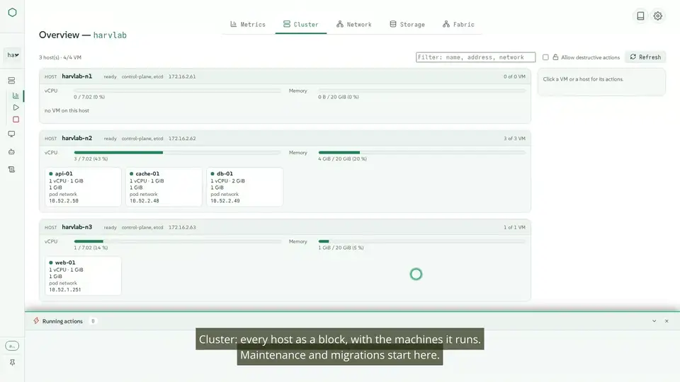

# harvester-ops

**A modern console to run a set of SUSE Harvester clusters: every cluster
in one interface, everyday operations automated, every event on record.**

English · [Français](README.fr.md)

[](LICENSE)
[](https://github.com/jniedergang/harvester-ops/releases/latest)
[](tests/)

> Independent open source project. Not affiliated with, endorsed by, or
> supported by SUSE.

[](https://github.com/jniedergang/harvester-ops/releases/download/v1.44.10/tour-en.mp4)

*A tour of the console, going down the left-hand menu. Click the picture
for the full video.*

## Why

Harvester's own interface works one cluster at a time. Running several
means going from one interface to the next, to `kubectl` and to scripts,
and nothing keeps track of who changed what, on which cluster, and when.

harvester-ops brings them together in one console built for day-2 work:
every cluster seen and operated from the same place, the everyday
operations turned into guided, repeatable actions, and every change
recorded, whether it was made from the console or somewhere else.

## What it is for

### Every cluster in one modern interface

- **All your clusters, one console.** Declare as many as you need and
  switch in one click: every view follows. A cluster that is powered off or
  unreachable says so within two seconds, and the others keep working.
- **Views laid out one block per object**: hosts and the VMs they run,
  networks and what is attached to them, storage classes, volumes and the
  space really left on each disk, network cards, bonds and virtual
  switches.
- **A console that stays live**: views refresh on their own, long
  operations stream their steps, consoles and editors open as windows kept
  in a bar, and a VM's VNC console can be watched by several people at
  once.
- **Five languages** (English, French, German, Spanish, Italian), light and
  dark themes, and a tooltip on every control.
- **Roles and identities**: viewer, operator and admin, denied by default,
  and actions carried out on the cluster under each operator's own
  identity.

### Automation made simple

- **Virtual machines**: guided creation that checks the space left as you
  type, templates, several machines in one go, a cloud-init assistant,
  bulk start, stop and run strategy, snapshots and restore, live migration.
- **Node maintenance, guided**: a pre-check says which VMs will migrate,
  which would stop and what would hold the drain, then the drain is
  followed to the end.
- **A whole cluster shut down and started in order**: eight steps down,
  five back up, each one checked before the next, and only the VMs that
  were running come back.
- **Infrastructure as code and provisioning**: saved Terraform
  declarations and the Harvester provider installed from the console;
  the Cluster API stack and its downstream RKE2 clusters; Harvester
  installed on a blank machine over Redfish virtual media.
- **Scriptable**: the power sequencing also runs from the command line,
  for pipelines and airgapped sites, and every operation has a dry run.

### Every event on record

- **Every change is an action**: it gets an id the moment it starts, its
  steps stream live to the dock at the bottom of every page, and its full
  log is kept. The history is searchable by cluster, state, kind or any
  word.
- **Changes made elsewhere show up too.** Namespaces, images and their
  uploads, networks, volume claims and VMs are watched on each cluster;
  what was changed from the Harvester interface, `kubectl` or Rancher is
  recorded the same way, including what changed while the console itself
  was stopped.
- **Nothing is anonymous**: every log line names its cluster, and a failed
  action keeps the underlying error rather than a bare exit code.
- **Shared context**: collaborative notes on clusters, nodes and VMs,
  Prometheus metrics broken down by cluster, and an anonymised support
  bundle in one click.

## Watch it work

Short clips filmed on a real three-node cluster, with captions. Waits are
sped up, with the factor shown on screen; nothing is cut.

| Clip | What you see | Watch |
|---|---|---|
| **Tour** (2:23) | Every entry of the menu, top to bottom, and the five interface languages | [English](https://github.com/jniedergang/harvester-ops/releases/download/v1.44.10/tour-en.mp4) · [Français](https://github.com/jniedergang/harvester-ops/releases/download/v1.44.10/tour-fr.mp4) |
| **Several clusters** (1:16) | Switching clusters, one that is powered off, cluster declarations and accounts | [English](https://github.com/jniedergang/harvester-ops/releases/download/v1.44.10/multi-cluster-en.mp4) · [Français](https://github.com/jniedergang/harvester-ops/releases/download/v1.44.10/multi-cluster-fr.mp4) |
| **Activity** (1:12) | Every action on record with its log, and a support bundle | [English](https://github.com/jniedergang/harvester-ops/releases/download/v1.44.10/activity-en.mp4) · [Français](https://github.com/jniedergang/harvester-ops/releases/download/v1.44.10/activity-fr.mp4) |
| **Virtual machines** (1:17) | The VM list, guided creation, and the built-in console | [English](https://github.com/jniedergang/harvester-ops/releases/download/v1.44.10/vms-console-en.mp4) · [Français](https://github.com/jniedergang/harvester-ops/releases/download/v1.44.10/vms-console-fr.mp4) |
| **Snapshots** (1:50) | A VM snapshot taken, the VM changed, and restored | [English](https://github.com/jniedergang/harvester-ops/releases/download/v1.44.10/snapshots-en.mp4) · [Français](https://github.com/jniedergang/harvester-ops/releases/download/v1.44.10/snapshots-fr.mp4) |
| **Node maintenance** (1:43) | The pre-check, a host drained while its VMs live-migrate, then a VM moved by hand | [English](https://github.com/jniedergang/harvester-ops/releases/download/v1.44.10/cluster-maintenance-en.mp4) · [Français](https://github.com/jniedergang/harvester-ops/releases/download/v1.44.10/cluster-maintenance-fr.mp4) |
| **Storage** (0:54) | Space really left, and a degraded volume explained while it rebuilds | [English](https://github.com/jniedergang/harvester-ops/releases/download/v1.44.10/storage-en.mp4) · [Français](https://github.com/jniedergang/harvester-ops/releases/download/v1.44.10/storage-fr.mp4) |
| **Network** (1:12) | Networks, the physical fabric, and the path of a VM | [English](https://github.com/jniedergang/harvester-ops/releases/download/v1.44.10/network-en.mp4) · [Français](https://github.com/jniedergang/harvester-ops/releases/download/v1.44.10/network-fr.mp4) |
| **Shutdown and startup** (2:16) | A whole cluster powered off in order, then brought back | [English](https://github.com/jniedergang/harvester-ops/releases/download/v1.44.10/shutdown-startup-en.mp4) · [Français](https://github.com/jniedergang/harvester-ops/releases/download/v1.44.10/shutdown-startup-fr.mp4) |

## Screenshots

| | |
|---|---|
| [](docs/assets/cluster.png) | [](docs/assets/activity.png) |
| Cluster view, with a node maintenance pre-check | Activity: every action and its log |
| [](docs/assets/vms.png) | [](docs/assets/console.png) |
| Virtual machines of a namespace | Built-in VNC console |
| [](docs/assets/storage.png) | [](docs/assets/fabric.png) |
| Storage, with a volume being rebuilt | Physical fabric of the cluster |
| [](docs/assets/shutdown.png) | [](docs/assets/baremetal.png) |
| The eight shutdown steps | Bare-metal: Redfish discovery and unattended install |

## Quick start

```bash
# On the operations workstation
tar xzf harvester-ops-<version>.tar.gz
cd harvester-ops-<version>
sudo ./install.sh                      # interactive installer
xdg-open https://localhost:8090        # the console
```

Declare your clusters in the console (Settings, Clusters: a kubeconfig and,
for power operations, an SSH key), or in `/etc/harvester-ops/config.yaml`.

The power sequencing also runs from the command line, which is what scripts
and airgapped sites use:

```bash
harvester-status   --cluster prod
harvester-shutdown --cluster prod --dry-run
harvester-startup  --cluster prod
```

See [install](docs/en/install.md) and the
[operating procedure](docs/en/operating-procedure.md).

## How it is built

- **One engine, two ways in.** The operations that must work without the
  console (power sequencing, status) live in auditable bash scripts
  (`bin/`) needing only `kubectl` and `ssh`. The console (Flask, plain
  JavaScript, no framework) runs those same scripts and never goes around
  them.
- **Offline by design**: one tarball with its SHA-256 checksum, the Python
  wheels and the container image inside; nothing is fetched at run time.
- **Installed as a systemd service** that runs a read-only container, built
  on SUSE BCI, under an unprivileged account.

## Tested on real clusters

Unit and browser tests run on every change (over 1,000 backend tests and
200 browser tests). Each feature is also exercised on a real cluster
before release: a single-node production cluster, and a three-node test
cluster for what needs several nodes (maintenance, migration, a full
shutdown and startup). The clips above were filmed on that test cluster,
and filming them found and fixed defects that no single-node cluster could
show; the [changelog](CHANGELOG.md) tells each story.

## Documentation

[Capabilities](docs/en/capabilities.md) ·
[Operating procedure](docs/en/operating-procedure.md) ·
[Architecture](docs/en/architecture.md) ·
[Install](docs/en/install.md) ·
[Bare-metal](docs/en/bare-metal.md) ·
[Troubleshooting](docs/en/troubleshooting.md) ·
[Changelog](CHANGELOG.md)

<details>
<summary>What the tarball contains</summary>

```
harvester-ops/
├── README.md, README.fr.md, VERSION, CHANGELOG.md, LICENSE
├── install.sh, uninstall.sh        interactive installer
├── web/                            the console
│   ├── app.py
│   ├── templates/, static/         plain JavaScript interface
│   └── vendor/                     Python wheels, for airgapped sites
├── bin/
│   ├── harvester-shutdown.sh       shutdown engine (8 steps)
│   ├── harvester-startup.sh        startup engine (5 steps)
│   ├── harvester-status.sh         cluster state (text or JSON)
│   └── lib/common.sh               logs, dry run, live step events
├── container/Containerfile         FROM registry.suse.com/bci/python:3.11
├── images/harvester-ops-ui.tar     OCI image (podman load)
├── config/                         example config, systemd unit
└── docs/en/, docs/fr/
```

</details>

## Contributing

See [CONTRIBUTING.md](CONTRIBUTING.md) for the layout, the setup and the
release flow. Every change comes with a test, a `VERSION` bump and a
`CHANGELOG.md` entry.

## License

Apache License 2.0, see [LICENSE](LICENSE).
